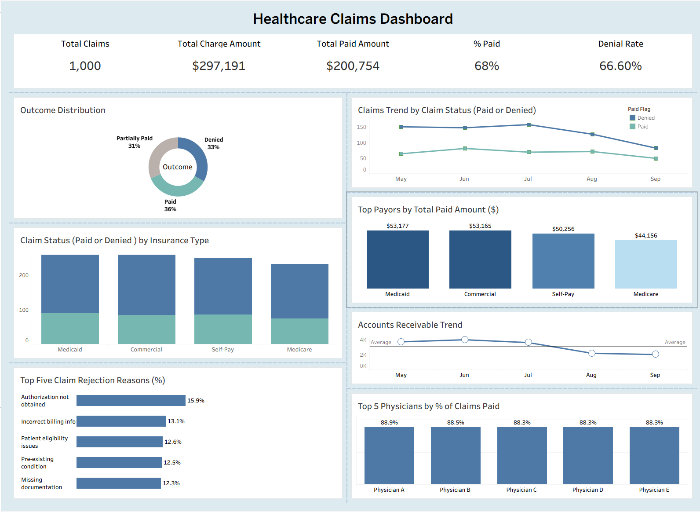

# **Healthcare-Claims-Dashboard**

📋 **Project Overview**  
A data visualization project showcasing **healthcare claim performance insights** through an interactive **Tableau dashboard**, built using a **synthetic healthcare claims dataset from Kaggle**.  
The dashboard consolidates key metrics — **Total Claims, Total Charges, Paid %, and Denial Rate** — and enables dynamic exploration by **insurance type, physician, and claim status** through interactive visual filters.

---

🖼️ **Dashboard Preview**  

  

  

---

🎯 **Objectives**
- Analyze claim outcomes (Paid, Partially Paid, Denied) to identify performance trends.  
- Evaluate payment efficiency across insurance types and payors.  
- Investigate top claim rejection reasons and physician performance.  
- Demonstrate expertise in healthcare data analytics, Tableau design, and KPI storytelling.

---

📊 **Key Insights**
- 💰 **Total Claims:** 1,000  
- 💵 **Paid Rate:** 68% of total claims successfully reimbursed.  
- 🚫 **Denial Rate:** 66.6%, driven by billing and authorization issues.  
- 🏦 **Top Payers:** Medicaid and Commercial plans contributed the highest total payments.  
- 👨‍⚕️ **Physician Performance:** Top 5 physicians maintained an 88%+ claim approval rate.  
- 📄 **Top Rejection Reasons:** Authorization not obtained, incorrect billing info, and patient eligibility issues.

---

⚙️ **Process**

### **1. Data Source**
- a href="https://github.com/fretaabrish/Healthcare-Claims-Analytics-Dashboard-Tableau/blob/main/Health_claim_raw_data.csv"> *Synthetic Health claim raw data Kaggle*</a>
  > Randomly generated for educational and analytical practice; contains no real patient data.

### **2. Data Preparation**
- Cleaned and structured data using **Python (Pandas, NumPy)**.  
- Standardized columns, parsed date formats, and handled missing or inconsistent values.  
- Computed derived metrics including **Paid %, Denial Rate, and Claim Duration**.

### **3. Dashboard Development**
- Designed KPI cards for **Total Claims, Paid %, and Denial Rate**.  
- Created visuals for:  
  - **Outcome Distribution** (Donut Chart)  
  - **Claim Trends by Status** (Line Chart)  
  - **Top Payers by Total Paid Amount** (Bar Chart)  
  - **Claim Status by Insurance Type** (Stacked Bar Chart)  
  - **Top Rejection Reasons** (Horizontal Bar Chart)  
  - **Physician Performance** (Bar Chart)  
- Integrated interactive filters for **Claim Status**, **Insurance Type**, and **Physician** to support exploratory analysis.

---

🛠️ **Tools & Technologies**
- **Visualization:** Tableau  
- **Data Preparation:** Python (Pandas, NumPy, Jupyter Notebook)  
- **Data Source:** Kaggle Synthetic Healthcare Claims  

---

📈 **Results**
- Built a **clean and interactive dashboard** presenting financial and operational claim metrics.  
- Identified key drivers of claim denials and payer performance trends.  
- Delivered actionable insights supporting claim management and billing optimization.  
- Demonstrated expertise in **healthcare analytics, dashboard storytelling, and metric design**.

---

💡 **Skills Demonstrated**
- Healthcare Data Wrangling and Quality Checks  
- KPI Computation (Paid %, Denial Rate, Top Payers)  
- Interactive Dashboard Development in Tableau  
- Analytical Storytelling and Insight Communication  
- Visualization and UI/UX Design Best Practices  

---

🧩 **How to Use**
1. View the **dashboard screenshot** above for a quick overview of the visual insights.
2. Explore the supporting data and scripts in the repository folders.
3. Optionally, recreate or enhance the dashboard using the dataset provided.

---

📚 **Dataset Reference**
**Kaggle:** Synthetic Healthcare Claims Dataset  
> *This dataset is randomly generated and suitable for educational and demonstration purposes only. No real patient data is included.*

---

👤 **Author**
**Frew Berhe**  
📍 Data Scientist | Healthcare & Machine Learning Analytics  
🔗 [LinkedIn](https://www.linkedin.com/in/frewberhe)  
💻 [GitHub](https://github.com/fretaabrish)

⭐ If you find this project helpful, consider giving it a **star**!
